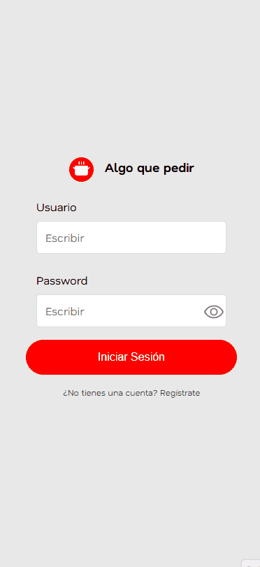
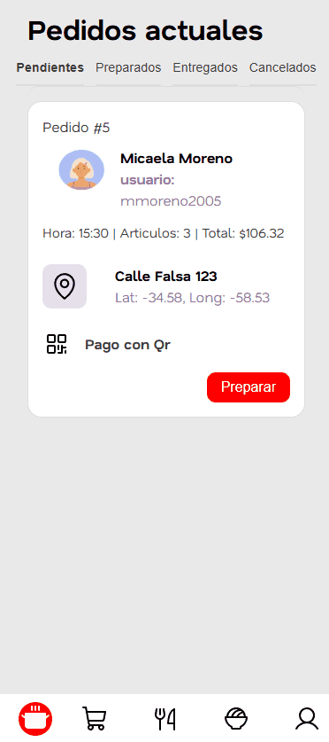
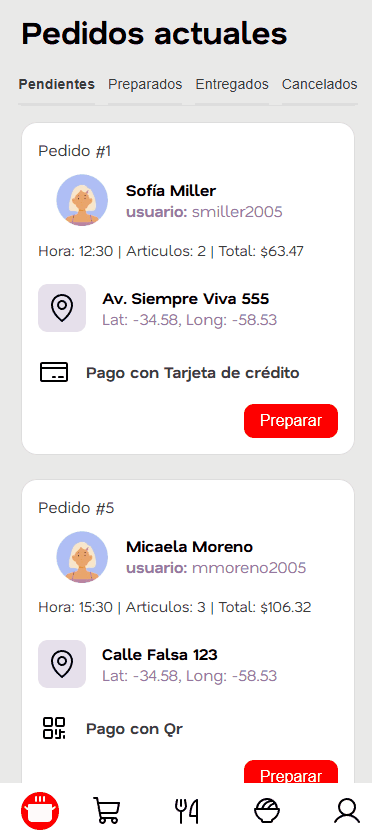

# Algo que Pedir - Svelte

Este proyecto es una aplicación de **back-office** diseñada para la gestión de pedidos y administración de un restaurante. Fue desarrollada como parte de la materia **Algoritmos 3** en la **Universidad Nacional de San Martín (UNSAM)**.

La aplicación permite a los administradores y empleados del local gestionar el ciclo de vida de los pedidos, administrar el menú (platos e ingredientes) y configurar el perfil del establecimiento.

## Arquitectura y Tecnologías

El sistema se divide en una arquitectura cliente-servidor:

- **Frontend:** Desarrollado con **Svelte 5** (utilizando Runes API para reactividad) y **TypeScript**. Se utiliza **Vite** como herramienta de construcción y **SvelteKit** para el ruteo.
- [**Backend:**](https://github.com/joanavarro23/algo-que-pedir-backend.git) Una API REST hosteada y desarrollada con **Spring Boot** y **Kotlin**, encargada de la persistencia y lógica de negocio.
- **Comunicación:** Se utiliza **Axios** para las peticiones asincrónicas entre el frontend y el backend.

## Pantallas y Funcionalidades

### Autenticación
- **Login:** Pantalla de acceso para usuarios registrados.
- **Registro:** Permite la creación de nuevas cuentas para administradores del local.

El proceso verifica que el usuario exista en el back-end y tenga los permisos requeridos para acceder a la palicación.

### Gestión de Pedidos
- **Pedidos Actuales:** Dashboard principal donde se visualizan los pedidos entrantes y en curso. Permite cambiar el estado de los mismos (ej. de "Pendiente" a "Enviado").
- **Detalle de Pedido:** Vista exhaustiva de un pedido específico, mostrando los platos solicitados, datos del cliente, método de pago y desglose de costos.

### Administración del Menú
- **Menú:** Listado completo de los platos ofrecidos por el restaurante. Permite visualizar precios y disponibilidad.
- **Edición de Platos:** Interfaz para modificar los detalles de un plato existente o crear nuevos platos.
- **Ingredientes:** Listado y gestión de los insumos disponibles en el local.
- **Edición de Ingredientes:** Permite ajustar los costos de mercado, nombres y categorías (grupo alimenticio, origen animal/vegetal) de los ingredientes.

### Configuración
- **Perfil del Local:** Espacio para administrar la información del restaurante, como nombre, dirección, imagen de portada y horarios de atención.

